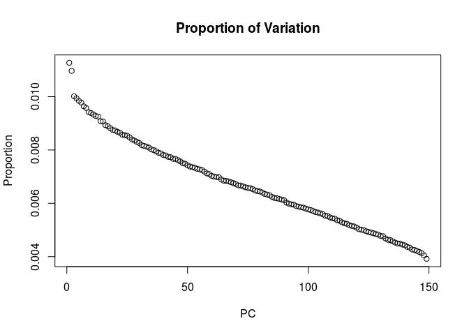
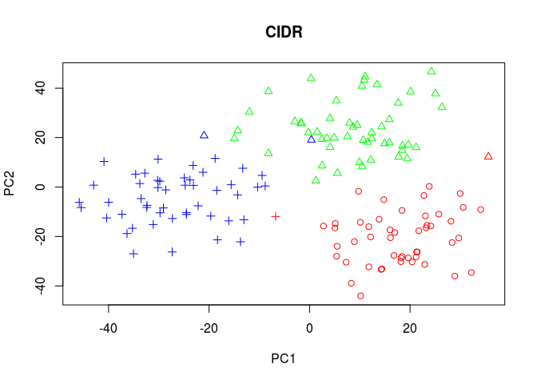

<!-- README.md is generated from README.Rmd. Please edit that file -->
<a href="url"></a>
=============================================================================================================================================

Clustering through Imputation and Dimensionality Reduction
==========================================================

Ultrafast and accurate clustering through imputation and dimensionality reduction for single-cell RNA-seq data.

Most existing dimensionality reduction and clustering packages for single-cell RNA-Seq (scRNA-Seq) data deal with dropouts by heavy modelling and computational machinery. Here we introduce *CIDR* (Clustering through Imputation and Dimensionality Reduction), an ultrafast algorithm which uses a novel yet very simple ‘implicit imputation’ approach to alleviate the impact of dropouts in scRNA-Seq data in a principled manner.

For more details about *CIDR* refer to the [preprint](http://biorxiv.org/content/early/2017/01/26/068775) on BioRxiv.

*CIDR* is maintained by Dr Paul Lin <p.lin@victorchang.edu.au>.

Getting Started
---------------

-   Make sure your version of R is at least 3.1.0.
-   *CIDR* has been tested primarily on the Linux and Mac platforms. *CIDR* has also been tested on the Windows platform - however this requires the use of an external software package *Rtools*.
-   If you are on the Windows platorm, ensure that [Rtools](https://cran.r-project.org/bin/windows/Rtools/) is installed. Rtools is software (installed external to R) that assists in building R packages, and R itself. Note that the downlaod for *Rtools* is in the order of 100M.
-   Install the CRAN package *devtools* package which will be used to install *CIDR* and its dependencies:

``` r
## this is an R command
install.packages("devtools")
```

-   Install the *CIDR* package directly from the Github repository (including any dependencies):

``` r
## this is an R command
devtools::install_github("VCCRI/CIDR")
## Note that for some Windows platforms, you may be asked to re-install RTools
## - even though it may already have been installed.  Say yes if prompted.
## Your windows platform may require the specific version of RTools being suggested.
```

Examples
========

Simulated Data
--------------

Test the newly installed *CIDR* package:

``` r
library(cidr)
example("cidr")
#> 
#> cidr> par(ask=FALSE)
#> 
#> cidr> ## Generate simulated single-cell RNA-Seq tags.
#> cidr> N=3 ## 3 cell types
#> 
#> cidr> k=50 ## 50 cells per cell type
#> 
#> cidr> sData <- scSimulator(N=N, k=k)
#> 
#> cidr> ## tags - the tag matrix
#> cidr> tags <- as.matrix(sData$tags)
#> 
#> cidr> cols <- c(rep("RED",k), rep("BLUE",k), rep("GREEN",k))
#> 
#> cidr> ## Standard principal component analysis.
#> cidr> ltpm <- log2(t(t(tags)/colSums(tags))*1000000+1)
#> 
#> cidr> pca <- prcomp(t(ltpm))
#> 
#> cidr> plot(pca$x[,c(1,2)],col=cols,pch=1,xlab="PC1",ylab="PC2",main="prcomp")
```


    #> 
    #> cidr> ## Use cidr to analyse the simulated dataset.
    #> cidr> ## The input for cidr should be a tag matrix.
    #> cidr> sData <- scDataConstructor(tags)
    #> 
    #> cidr> sData <- determineDropoutCandidates(sData)
    #> 
    #> cidr> sData <- wThreshold(sData)



    #> 
    #> cidr> sData <- scDissim(sData)
    #> 
    #> cidr> sData <- scPCA(sData)


    #> 
    #> cidr> nCluster(sData)



    #> 
    #> cidr> sData <- scCluster(sData)
    #> 
    #> cidr> ## Two dimensional visualization: different colors denote different cell types,
    #> cidr> ## while different plotting symbols denote the clusters output by cidr.
    #> cidr> plot(sData@PC[,c(1,2)], col=cols,
    #> cidr+      pch=sData@clusters, main="CIDR", xlab="PC1", ylab="PC2")
    #> 
    #> cidr> ## Use Adjusted Rand Index to measure the accuracy of the clustering output by cidr.
    #> cidr> adjustedRandIndex(sData@clusters,cols)
    #> [1] 0.9203693
    #> 
    #> cidr> ## 0.79
    #> cidr> ## Alter the number of PCs used in clustering.
    #> cidr> sData <- scCluster(sData, nPC=2)
    #> 
    #> cidr> plot(sData@PC[,c(1,2)], col=cols,
    #> cidr+      pch=sData@clusters,main="CIDR",xlab="PC1", ylab="PC2")


    #> 
    #> cidr> adjustedRandIndex(sData@clusters,cols)
    #> [1] 0.9203693
    #> 
    #> cidr> ## 0.92
    #> cidr> 
    #> cidr> 
    #> cidr>

Biological Datasets
-------------------

Examples of applying *CIDR* to real biological datasets can be found at this [Github repository](https://github.com/VCCRI/CIDR-examples). The name of the repository is *CIDR-examples*.

Clicking on the *Clone or Download* button in the Github repository for *CIDR-examples* will enable the user to download a zip file containing the raw biological data and the R files for the examples. The user can then extract the files and run the provided R examples.

### Human Brain scRNA-Seq Dataset

*CIDR-examples* contains a human brain single-cell RNA-Seq dataset, located in the *Brain* folder. In this dataset there are 420 cells in 8 cell types after we exclude hybrid cells.

Reference for the human brain dataset:

Darmanis, S. *et al.* A survey of human brain transcriptome diversity at the single cell level. *Proceedings of the National Academy of Sciences* 112, 7285–7290 (2015).

### Human Pancreatic Islet scRNA-Seq Dataset

*CIDR-examples* contains a human pancreatic islet single-cell RNA-Seq dataset, located in the *PancreaticIslet* folder. In this dataset there are 60 cells in 6 cell types after we exclude undefined cells and bulk RNA-Seq samples.

Reference for the human pancreatic islet dataset:

Li, J. *et al.* Single-cell transcriptomes reveal characteristic features of human pancreatic islet cell types. *EMBO Reports* 17, 178–187 (2016).

Troubleshooting
---------------

### Masking of *hclust*

*CIDR* utilises the *hclust* function from the base *stats* package. Loading *CIDR* masks *hclust* in other packages automatically. However, if any package with an *hclust* function (e.g., *flashClust*) is loaded after *CIDR*, the name clashing can possibly cause a problem. In this case unloading that package should resolve the issue.

### Reinstallation of *CIDR* - cidr.rdb corruption

In some cases when installing a new version of *CIDR* on top of an existing version may result in the following error message:

`Error in fetch(key) : lazy-load database '/Library/Frameworks/R.framework/Versions/3.3/Resources/library/cidr/help/cidr.rdb' is corrupt`

In this case, one way to resolve this issue is to reinstall the *devtools* package:

``` r
install.packages("devtools")
## Click “Yes” in “Updating Loaded Packages”
devtools::install_github("VCCRI/CIDR",force=TRUE)
```
Some users might have installed an older version of RcppEigen. CIDR requires RcppEigen version >=0.3.2.9.0. Please re-install the latest version of this package if necessary.
